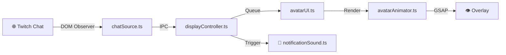

<div align="center">


# Keeping an Eye on the Chat

**Lightweight Twitch chat overlay with animated avatar for streamers**

[](https://electronjs.org)
[](https://typescriptlang.org)
[](LICENSE)
[](https://github.com)

*Show Twitch chat messages with a cute animated avatar on your stream!*

[🚀 Getting Started](#-getting-started) •
[⚙️ Configuration](#️-configuration) •
[📖 Documentation](#-documentation) •
[🤝 Contributing](#-contributing)

</div>

---

## 👁️ Preview

<div align="center">


*Chat messages appear with an animated avatar and speech bubble*
</div>

## ✨ Features

- 🎭 **Animated Avatar** — Cute character with lip-sync, blinking, and expressions powered by GSAP
- 💬 **Chat Bubbles** — Clean speech bubbles with smooth enter/exit animations
- 🔔 **Notification Sound** — Customizable audio alert with test preview, volume control, and quick mute from System Tray
- 🎯 **Transparent Overlay** — Click-through window that sits on top of your game/content
- ⚡ **Lightweight** — Minimal resource usage, optimized for streaming
- 🎨 **Customizable Position** — Place the overlay in any corner with adjustable margins
- 🖥️ **Multi-Monitor Support** — Choose which display shows the overlay
- 🔧 **Easy Configuration** — Built-in wizard with presets, collapsible sections, and intuitive controls
- 🖥️ **System Tray Integration** — Quick access to settings and sound mute toggle
- 🌍 **Multilingual** — English and Portuguese interface

## 📋 MVP Scope

| ✅ Included | ❌ Non-Goals |
|-------------|-------------|
| Twitch popout chat DOM observation | Chatbot / LLM integration |
| Message queue with timed display | Moderation features |
| Animated avatar with speech bubbles | Message storage / history |
| Notification sound with test/mute | TTS (text-to-speech) support |
| System Tray with quick controls | Complex filtering rules |
| Multi-monitor display selection | |
| Configuration wizard with collapsible UI | |
| Graceful error handling | |

## 🚀 Getting Started

### Prerequisites

- [Node.js](https://nodejs.org) 18+
- npm 9+

### Installation

```bash
# Clone the repository
git clone https://github.com/didevlab/keeping-an-eye-on-the-chat.git
cd keeping-an-eye-on-the-chat

# Install dependencies
npm install
```

### Running

```bash
# Start the app (opens configuration wizard)
npm start

# Start with diagnostics enabled
npm run start:diag

# Start in overlay-only mode (no debug UI)
npm run start:overlay
```

> 💡 **Tip:** On first run, the configuration wizard will guide you through setup.

## ⚙️ Configuration

### 🧙 Configuration Wizard

The built-in wizard provides an easy way to configure the overlay:

<div align="center">


*Configuration wizard with dark theme and intuitive controls*
</div>

1. **Twitch Chat URL** — Get this from your channel: `https://www.twitch.tv/popout/YOURNAME/chat?popout=`
2. **Presets** — Quick setup options for different stream styles
3. **Position & Timing** — Customize where and how long messages appear
4. **Display Selection** — Choose which monitor to show the overlay (for multi-monitor setups)

**UI Features:**
- **Collapsible sections** — Click on section headers (Overlay, Sound, Performance, Advanced) to expand/collapse
- **Logo link** — Click the logo to visit the developer's GitHub profile
- **Dark theme** — Easy on the eyes with a modern interface

### 🖥️ System Tray

After starting the overlay, the app remains accessible via the System Tray:

<div align="center">


*Right-click the tray icon to access settings or quit*
</div>

- **Right-click** — Opens menu with:
  - **Mutar/Desmutar Som** — Toggle notification sound on/off
  - **Abrir Configurações** — Opens configuration window
  - **Sair** — Quit the application
- **Double-click** — Opens configuration window directly

> 💡 **Note:** The overlay window is transparent and doesn't appear in the taskbar, so the System Tray is your main way to interact with the app while it's running.

### 🔔 Notification Sound

A notification sound plays whenever a new chat message appears. This feature is **enabled by default** to catch your attention during streams.

- **Enabled by default** — Sound plays automatically when messages appear
- **Customizable volume** — Adjust from 0-100% in settings
- **Custom sounds** — Select any audio file from your computer via the file browser
- **Supported formats** — `.mp3`, `.wav`, `.ogg`, `.m4a`, `.flac`, `.aac`
- **Audio output device** — Select which audio device plays the notification
- **Test button** — Preview the sound before starting the overlay
- **Quick mute** — Toggle sound on/off from the System Tray without opening settings

To use a custom sound:
1. Click "Browse..." in the Sound section of the configuration
2. Select your audio file from any location on your computer
3. Adjust volume and test with the "Test" button
4. Use the System Tray to quickly mute/unmute during streams

### 🖥️ Multi-Monitor Support

If you have multiple monitors, you can choose which display shows the overlay:

1. Open the **Overlay Settings** section in the configuration wizard
2. Find the **Display** dropdown
3. Select your preferred monitor from the list

**Features:**
- **Automatic detection** — All connected monitors are listed automatically
- **Primary indicator** — The primary display is marked with "(Primary)" / "(Principal)"
- **Resolution display** — Each monitor shows its resolution (e.g., "1920x1080")
- **Fallback** — If a saved monitor is disconnected, the overlay uses the primary display

> 💡 **Tip:** This is especially useful for streamers who want the overlay on their streaming monitor while keeping their main monitor free for gaming.

### 🔧 Environment Variables

For advanced users, all settings can be configured via environment variables:

| Variable | Default | Description |
|----------|---------|-------------|
| `TWITCH_CHAT_URL` | — | 📺 Twitch popout chat URL (**required**) |
| `DISPLAY_SECONDS` | `5` | ⏱️ Message display duration |
| `OVERLAY_ANCHOR` | `bottom-left` | 📍 Position: `bottom-left`, `bottom-right`, `top-left`, `top-right` |
| `OVERLAY_MARGIN` | `24` | 📏 Margin from screen edge (pixels) |
| `BUBBLE_MAX_WIDTH` | `420` | 📐 Maximum bubble width (pixels) |
| `MAX_MESSAGE_LENGTH` | `140` | ✂️ Truncate messages longer than this |
| `IGNORE_COMMAND_PREFIX` | `!` | 🚫 Ignore messages starting with this |
| `IGNORE_USERS` | — | 👤 Comma-separated usernames to ignore |
| `MAX_QUEUE_LENGTH` | `50` | 📚 Maximum queued messages |
| `EXIT_ANIMATION_MS` | `400` | 🎬 Exit animation duration (ms) |
| `DIAGNOSTICS` | `0` | 🔍 Enable diagnostic logs (`1` to enable) |
| `OVERLAY_DEBUG` | `0` | 🐛 Show debug UI (`1` to enable) |
| `NOTIFICATION_SOUND_ENABLED` | `1` | 🔔 Enable notification sound (`0` to disable) |
| `NOTIFICATION_SOUND_FILE` | `notification.wav` | 🎵 Sound file path (full path or filename in assets/sounds/) |
| `NOTIFICATION_SOUND_VOLUME` | `50` | 🔊 Volume level (0-100) |
| `NOTIFICATION_SOUND_DEVICE` | — | 🎧 Audio output device ID (system default if empty) |

### 🎯 Presets

| Preset | Description | Best For |
|--------|-------------|----------|
| **Default** | Balanced settings | Most streams |
| **Fast-Paced** | 3s display, larger queue | High-activity chat |
| **Cozy** | 8s display, smaller queue | Relaxed streams |

## 🏗️ Project Structure

```
📁 keeping-an-eye-on-the-chat/
├── 📁 src/                     # TypeScript source files
│   ├── 📁 main/                # Electron main process
│   │   ├── index.ts            # App entry point
│   │   ├── chatSource.ts       # Twitch chat DOM observer
│   │   ├── configWindow.ts     # Configuration window
│   │   └── ipcHandlers.ts      # IPC communication
│   ├── 📁 preload/             # Electron preload scripts
│   │   └── index.ts            # IPC bridge (contextBridge)
│   ├── 📁 renderer/            # Browser/renderer process
│   │   ├── 📁 overlay/         # Main overlay UI
│   │   │   ├── index.html
│   │   │   ├── 📁 scripts/     # Avatar, animations, display, sound
│   │   │   └── 📁 styles/      # CSS
│   │   ├── 📁 config/          # Configuration wizard
│   │   │   ├── index.html
│   │   │   ├── 📁 scripts/     # Form controller
│   │   │   └── 📁 styles/      # Dark theme
│   │   └── 📁 assets/          # Static assets
│   │       └── 📁 sounds/      # Notification sounds (.mp3, .wav, .ogg, .m4a)
│   ├── 📁 config/              # Configuration logic
│   │   ├── types.ts            # TypeScript interfaces
│   │   ├── schema.ts           # Config schema & validation
│   │   ├── defaults.ts         # Defaults & presets
│   │   ├── store.ts            # JSON persistence
│   │   └── merge.ts            # Config merge logic
│   └── 📁 shared/              # Shared types
│       └── 📁 types/           # ChatMessage, OverlayConfig
├── 📁 dist/                    # Compiled JavaScript (generated)
├── 📁 config/                  # TypeScript configuration
├── 📁 scripts/                 # Build scripts
├── 📁 packaging/               # Platform packaging helpers
└── 📁 openspec/                # Project specifications
```

## 🔄 Data Flow



1. **chatSource.ts** — Observes Twitch chat DOM via hidden BrowserView
2. **displayController.ts** — Manages message queue and timing
3. **notificationSound.ts** — Plays audio notification when message appears
4. **avatarUI.ts** — Renders avatar component and speech bubble
5. **avatarAnimator.ts** — Animates mouth, eyes, and expressions with GSAP

## 🛠️ Development

### Commands

| Command | Description |
|---------|-------------|
| `npm start` | 🚀 Run app (auto-builds) |
| `npm run start:diag` | 🔍 Run with diagnostics |
| `npm run start:overlay` | 🎭 Run in overlay mode |
| `npm run typecheck` | ✅ Type check without compiling |
| `npm run build:ts` | 🔨 Compile TypeScript to dist/ |
| `npm run build:win` | 📦 Build Windows zip |
| `npm run build:win:nsis` | 💿 Build Windows installer |

### Building for Windows

```bash
# Build portable zip (unsigned)
npm run build:win

# Build NSIS installer (unsigned)
npm run build:win:nsis
```

> ⚠️ **Note:** Windows builds are unsigned by default. See [CONFIGURATION.md](CONFIGURATION.md) for signing setup.

## 📖 Documentation

| Document | Description |
|----------|-------------|
| [📋 CONFIGURATION.md](CONFIGURATION.md) | Detailed configuration guide |
| [🤝 CONTRIBUTING.md](CONTRIBUTING.md) | How to contribute |
| [📜 CHANGELOG.md](CHANGELOG.md) | Version history |
| [📁 openspec/](openspec/) | Project specifications |

## 🤝 Contributing

Contributions are welcome! Please read [CONTRIBUTING.md](CONTRIBUTING.md) for guidelines.

1. 🍴 Fork the repository
2. 🌿 Create a feature branch (`git checkout -b feature/amazing-feature`)
3. 💾 Commit your changes (`git commit -m 'Add amazing feature'`)
4. 📤 Push to the branch (`git push origin feature/amazing-feature`)
5. 🔄 Open a Pull Request

## 🐛 Troubleshooting

<details>
<summary><strong>ERR_NAME_NOT_RESOLVED</strong></summary>

The Twitch URL cannot be resolved. Check:
1. ✅ Network connectivity
2. ✅ URL format: `https://www.twitch.tv/popout/<channel>/chat?popout=`
3. ✅ Channel name is valid
</details>

<details>
<summary><strong>Chat not loading</strong></summary>

1. ✅ Check `TWITCH_CHAT_URL` is set correctly
2. ✅ Run with `DIAGNOSTICS=1` to see detailed logs
3. ✅ Verify the channel is live with active chat
</details>

<details>
<summary><strong>Observer attachment timeout</strong></summary>

If you see "Chat source observer attachment timed out after 10s":
1. ⚠️ Twitch may have changed their DOM structure
2. 🔍 Run with `DIAGNOSTICS=1` for more details
3. 🐛 Report an issue if problem persists
</details>

<details>
<summary><strong>Notification sound not playing</strong></summary>

1. ✅ Check that "Enable Notification Sound" is enabled in settings
2. ✅ Verify the sound file exists in `src/renderer/assets/sounds/`
3. ✅ Ensure the filename matches exactly (case-sensitive)
4. ✅ Check volume is above 0%
5. ✅ Supported formats: `.mp3`, `.wav`, `.ogg`, `.m4a`
</details>

## 📄 License

This project is licensed under the MIT License - see the [LICENSE](LICENSE) file for details.

---

<div align="center">

**Made with ❤️ for streamers**

Created by [@didevlab](https://github.com/didevlab)

[⬆ Back to top](#️-keeping-an-eye-on-the-chat)

</div>
