<div align="center">


# Keeping an Eye on the Chat

**Lightweight Twitch chat overlay with animated avatar for streamers**

[](https://electronjs.org)
[](https://typescriptlang.org)
[](LICENSE)
[](https://github.com)

*Show Twitch chat messages with a cute animated avatar on your stream!*

[🚀 Getting Started](#-getting-started) •
[⚙️ Configuration](#️-configuration) •
[📖 Documentation](#-documentation) •
[🤝 Contributing](#-contributing)

</div>

---

## 👁️ Preview

<div align="center">


*Chat messages appear with an animated avatar and speech bubble*
</div>

## ✨ Features

- 🎭 **Animated Avatar** — Cute character with lip-sync, blinking, and expressions powered by GSAP
- 💬 **Chat Bubbles** — Clean speech bubbles with smooth enter/exit animations
- 🔔 **Notification Sound** — Customizable audio alert when new messages appear (enabled by default)
- 🎯 **Transparent Overlay** — Click-through window that sits on top of your game/content
- ⚡ **Lightweight** — Minimal resource usage, optimized for streaming
- 🎨 **Customizable Position** — Place the overlay in any corner with adjustable margins
- 🔧 **Easy Configuration** — Built-in wizard with presets for quick setup
- 🌍 **Multilingual** — English and Portuguese interface

## 📋 MVP Scope

| ✅ Included | ❌ Non-Goals |
|-------------|-------------|
| Twitch popout chat DOM observation | Chatbot / LLM integration |
| Message queue with timed display | Moderation features |
| Animated avatar with speech bubbles | Message storage / history |
| Notification sound on new messages | TTS (text-to-speech) support |
| Graceful error handling | Complex filtering rules |
| Configuration wizard | |

## 🚀 Getting Started

### Prerequisites

- [Node.js](https://nodejs.org) 18+
- npm 9+

### Installation

```bash
# Clone the repository
git clone https://github.com/didevlab/keeping-an-eye-on-the-chat.git
cd keeping-an-eye-on-the-chat

# Install dependencies
npm install
```

### Running

```bash
# Start the app (opens configuration wizard)
npm start

# Start with diagnostics enabled
npm run start:diag

# Start in overlay-only mode (no debug UI)
npm run start:overlay
```

> 💡 **Tip:** On first run, the configuration wizard will guide you through setup.

## ⚙️ Configuration

### 🧙 Configuration Wizard

The built-in wizard provides an easy way to configure the overlay:

<div align="center">


*Configuration wizard with dark theme and intuitive controls*
</div>

1. **Twitch Chat URL** — Get this from your channel: `https://www.twitch.tv/popout/YOURNAME/chat?popout=`
2. **Presets** — Quick setup options for different stream styles
3. **Position & Timing** — Customize where and how long messages appear

### 🖥️ System Tray

After starting the overlay, the app remains accessible via the System Tray:

<div align="center">


*Right-click the tray icon to access settings or quit*
</div>

- **Right-click** — Opens menu with "Abrir Configurações" (Settings) and "Sair" (Quit)
- **Double-click** — Opens configuration window directly

> 💡 **Note:** The overlay window is transparent and doesn't appear in the taskbar, so the System Tray is your main way to interact with the app while it's running.

### 🔔 Notification Sound

A notification sound plays whenever a new chat message appears. This feature is **enabled by default** to catch your attention during streams.

- **Enabled by default** — Sound plays automatically when messages appear
- **Customizable volume** — Adjust from 0-100% in settings
- **Custom sounds** — Add your own audio files to `src/renderer/assets/sounds/`
- **Supported formats** — `.mp3`, `.wav`, `.ogg`, `.m4a`

To use a custom sound:
1. Place your audio file in `src/renderer/assets/sounds/`
2. Enter the filename in the "Notification Sound" field (e.g., `mysound.mp3`)
3. Adjust volume as needed

### 🔧 Environment Variables

For advanced users, all settings can be configured via environment variables:

| Variable | Default | Description |
|----------|---------|-------------|
| `TWITCH_CHAT_URL` | — | 📺 Twitch popout chat URL (**required**) |
| `DISPLAY_SECONDS` | `5` | ⏱️ Message display duration |
| `OVERLAY_ANCHOR` | `bottom-left` | 📍 Position: `bottom-left`, `bottom-right`, `top-left`, `top-right` |
| `OVERLAY_MARGIN` | `24` | 📏 Margin from screen edge (pixels) |
| `BUBBLE_MAX_WIDTH` | `420` | 📐 Maximum bubble width (pixels) |
| `MAX_MESSAGE_LENGTH` | `140` | ✂️ Truncate messages longer than this |
| `IGNORE_COMMAND_PREFIX` | `!` | 🚫 Ignore messages starting with this |
| `IGNORE_USERS` | — | 👤 Comma-separated usernames to ignore |
| `MAX_QUEUE_LENGTH` | `50` | 📚 Maximum queued messages |
| `EXIT_ANIMATION_MS` | `400` | 🎬 Exit animation duration (ms) |
| `DIAGNOSTICS` | `0` | 🔍 Enable diagnostic logs (`1` to enable) |
| `OVERLAY_DEBUG` | `0` | 🐛 Show debug UI (`1` to enable) |
| `NOTIFICATION_SOUND_ENABLED` | `1` | 🔔 Enable notification sound (`0` to disable) |
| `NOTIFICATION_SOUND_FILE` | `notification.wav` | 🎵 Sound file name (in assets/sounds/) |
| `NOTIFICATION_SOUND_VOLUME` | `50` | 🔊 Volume level (0-100) |

### 🎯 Presets

| Preset | Description | Best For |
|--------|-------------|----------|
| **Default** | Balanced settings | Most streams |
| **Fast-Paced** | 3s display, larger queue | High-activity chat |
| **Cozy** | 8s display, smaller queue | Relaxed streams |

## 🏗️ Project Structure

```
📁 keeping-an-eye-on-the-chat/
├── 📁 src/                     # TypeScript source files
│   ├── 📁 main/                # Electron main process
│   │   ├── index.ts            # App entry point
│   │   ├── chatSource.ts       # Twitch chat DOM observer
│   │   ├── configWindow.ts     # Configuration window
│   │   └── ipcHandlers.ts      # IPC communication
│   ├── 📁 preload/             # Electron preload scripts
│   │   └── index.ts            # IPC bridge (contextBridge)
│   ├── 📁 renderer/            # Browser/renderer process
│   │   ├── 📁 overlay/         # Main overlay UI
│   │   │   ├── index.html
│   │   │   ├── 📁 scripts/     # Avatar, animations, display, sound
│   │   │   └── 📁 styles/      # CSS
│   │   ├── 📁 config/          # Configuration wizard
│   │   │   ├── index.html
│   │   │   ├── 📁 scripts/     # Form controller
│   │   │   └── 📁 styles/      # Dark theme
│   │   └── 📁 assets/          # Static assets
│   │       └── 📁 sounds/      # Notification sounds (.mp3, .wav, .ogg, .m4a)
│   ├── 📁 config/              # Configuration logic
│   │   ├── types.ts            # TypeScript interfaces
│   │   ├── schema.ts           # Config schema & validation
│   │   ├── defaults.ts         # Defaults & presets
│   │   ├── store.ts            # JSON persistence
│   │   └── merge.ts            # Config merge logic
│   └── 📁 shared/              # Shared types
│       └── 📁 types/           # ChatMessage, OverlayConfig
├── 📁 dist/                    # Compiled JavaScript (generated)
├── 📁 config/                  # TypeScript configuration
├── 📁 scripts/                 # Build scripts
├── 📁 packaging/               # Platform packaging helpers
└── 📁 openspec/                # Project specifications
```

## 🔄 Data Flow

```mermaid
graph LR
    A[🌐 Twitch Chat] -->|DOM Observer| B[chatSource.ts]
    B -->|IPC| C[displayController.ts]
    C -->|Queue| D[avatarUI.ts]
    C -->|Trigger| G[🔔 notificationSound.ts]
    D -->|Render| E[avatarAnimator.ts]
    E -->|GSAP| F[👁️ Overlay]
```



1. **chatSource.ts** — Observes Twitch chat DOM via hidden BrowserView
2. **displayController.ts** — Manages message queue and timing
3. **notificationSound.ts** — Plays audio notification when message appears
4. **avatarUI.ts** — Renders avatar component and speech bubble
5. **avatarAnimator.ts** — Animates mouth, eyes, and expressions with GSAP

## 🛠️ Development

### Commands

| Command | Description |
|---------|-------------|
| `npm start` | 🚀 Run app (auto-builds) |
| `npm run start:diag` | 🔍 Run with diagnostics |
| `npm run start:overlay` | 🎭 Run in overlay mode |
| `npm run typecheck` | ✅ Type check without compiling |
| `npm run build:ts` | 🔨 Compile TypeScript to dist/ |
| `npm run build:win` | 📦 Build Windows zip |
| `npm run build:win:nsis` | 💿 Build Windows installer |

### Building for Windows

```bash
# Build portable zip (unsigned)
npm run build:win

# Build NSIS installer (unsigned)
npm run build:win:nsis
```

> ⚠️ **Note:** Windows builds are unsigned by default. See [CONFIGURATION.md](CONFIGURATION.md) for signing setup.

## 📖 Documentation

| Document | Description |
|----------|-------------|
| [📋 CONFIGURATION.md](CONFIGURATION.md) | Detailed configuration guide |
| [🤝 CONTRIBUTING.md](CONTRIBUTING.md) | How to contribute |
| [📜 CHANGELOG.md](CHANGELOG.md) | Version history |
| [📁 openspec/](openspec/) | Project specifications |

## 🤝 Contributing

Contributions are welcome! Please read [CONTRIBUTING.md](CONTRIBUTING.md) for guidelines.

1. 🍴 Fork the repository
2. 🌿 Create a feature branch (`git checkout -b feature/amazing-feature`)
3. 💾 Commit your changes (`git commit -m 'Add amazing feature'`)
4. 📤 Push to the branch (`git push origin feature/amazing-feature`)
5. 🔄 Open a Pull Request

## 🐛 Troubleshooting

<details>
<summary><strong>ERR_NAME_NOT_RESOLVED</strong></summary>

The Twitch URL cannot be resolved. Check:
1. ✅ Network connectivity
2. ✅ URL format: `https://www.twitch.tv/popout/<channel>/chat?popout=`
3. ✅ Channel name is valid
</details>

<details>
<summary><strong>Chat not loading</strong></summary>

1. ✅ Check `TWITCH_CHAT_URL` is set correctly
2. ✅ Run with `DIAGNOSTICS=1` to see detailed logs
3. ✅ Verify the channel is live with active chat
</details>

<details>
<summary><strong>Observer attachment timeout</strong></summary>

If you see "Chat source observer attachment timed out after 10s":
1. ⚠️ Twitch may have changed their DOM structure
2. 🔍 Run with `DIAGNOSTICS=1` for more details
3. 🐛 Report an issue if problem persists
</details>

<details>
<summary><strong>Notification sound not playing</strong></summary>

1. ✅ Check that "Enable Notification Sound" is enabled in settings
2. ✅ Verify the sound file exists in `src/renderer/assets/sounds/`
3. ✅ Ensure the filename matches exactly (case-sensitive)
4. ✅ Check volume is above 0%
5. ✅ Supported formats: `.mp3`, `.wav`, `.ogg`, `.m4a`
</details>

## 📄 License

This project is licensed under the MIT License - see the [LICENSE](LICENSE) file for details.

---

<div align="center">

**Made with ❤️ for streamers**

Created by [@didevlab](https://github.com/didevlab)

[⬆ Back to top](#️-keeping-an-eye-on-the-chat)

</div>
