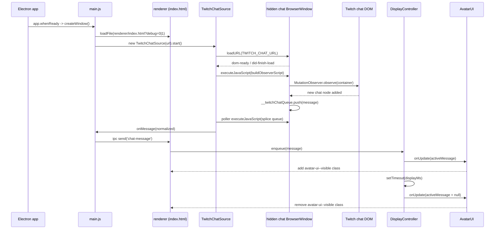

# First Message Flow (Overlay)

This document traces the exact code path for the first chat bubble that becomes visible in the overlay, starting at app boot and ending when the first bubble hides.

## Mermaid sequence diagram



## Timeline (T0..Tn)

1. T0 - Electron starts and runs `app.whenReady().then(createWindow)` in `src/main.js` so the main process owns overlay startup.
2. T1 - `createWindow()` builds the always-on-top transparent overlay `BrowserWindow` and loads `src/renderer/index.html` with the `debug` query param based on `OVERLAY_DEBUG` (and dev defaults).
3. T2 - The preload script `src/renderer/preload.js` runs in the overlay window and exposes `window.overlayChat` with `getConfig()` and `onMessage()`; `DISPLAY_SECONDS` and other config env vars are resolved here.
4. T3 - The renderer bootstraps `AvatarUI` and `DisplayController` in `src/renderer/index.html`, then registers `overlayChat.onMessage` to call `controller.enqueue(message)`.
5. T4 - The main process creates `TwitchChatSource` with `TWITCH_CHAT_URL` and `DIAGNOSTICS` and calls `start()`.
6. T5 - `TwitchChatSource.start()` opens a hidden `BrowserWindow`, starts polling every 250ms, and loads the Twitch popout chat URL.
7. T6 - When the hidden window hits `dom-ready` or `did-finish-load`, `attachObserverWithRetry()` attempts to inject the observer script until it finds a chat container or times out after 10s.
8. T7 - The injected script finds the chat container, marks existing chat nodes as seen, and attaches a `MutationObserver` to watch for new message nodes.
9. T8 - The first new message node appears in the Twitch DOM. The observer extracts `id`, `user`, `text`, and `timestamp` and pushes a raw item into `window.__twitchChatQueue`.
10. T9 - On the next poll tick, `flushQueue()` reads and clears `window.__twitchChatQueue`, normalizes the first item, deduplicates by `id`, and calls the main-process `onMessage`.
11. T10 - The main process sends the message to the overlay renderer via IPC (`chat-message`). The renderer logs it and calls `DisplayController.enqueue()`.
12. T11 - `DisplayController.enqueue()` filters the message, truncates if needed, pushes it into the queue, and immediately starts display because `activeMessage` is null.
13. T12 - The `onUpdate` callback calls `AvatarUI.setActiveMessage()`, which sets the bubble text and toggles the `avatar-ui--visible` class to animate the first bubble in.
14. T13 - After `displayMs` expires, `DisplayController` clears `activeMessage`, triggers another `onUpdate`, and the UI removes `avatar-ui--visible` to animate the bubble out.

## Boot sequence (main process to renderer)

- Main entry file: `src/main.js` sets up the Electron app lifecycle and builds the overlay `BrowserWindow` in `createWindow()` (`app.whenReady().then(createWindow)`).
- Renderer HTML/JS entry: `mainWindow.loadFile(..., { query: { debug }})` loads `src/renderer/index.html`, which loads `displayController.js`, `avatarUI.js`, and `avatarUI.css`.
- Env vars impacting startup:
  - `TWITCH_CHAT_URL` sets the hidden chat window URL; empty or invalid disables chat source.
  - `OVERLAY_DEBUG` controls the `debug` query param and the overlay debug panel; in dev, it defaults to enabled unless set to `0`.
  - `DIAGNOSTICS` toggles diagnostic logging in the main process and chat source.
  - `DISPLAY_SECONDS` is read in the preload script and controls display duration in the renderer (later converted to ms by `DisplayController`).

## Chat connection and observation setup

- Twitch chat is loaded in a hidden `BrowserWindow` (not a webview or iframe) via `this.window.loadURL(this.url)` in `TwitchChatSource.start()`.
- The observer script is injected using `webContents.executeJavaScript(buildObserverScript(...))` and attaches a `MutationObserver` on the first container that matches these selectors:
  - Container selectors: `[data-test-selector="chat-scrollable-area__message-container"]`, `[data-a-target="chat-scrollable-area__message-container"]`, `[role="log"]`, `.chat-scrollable-area__message-container`
  - Message selectors: `[data-a-target="chat-line-message"]`, `[data-test-selector="chat-line-message"]`, `[data-a-target="chat-message"]`, `.chat-line__message`
  - Username selectors: `[data-a-target="chat-message-username"]`, `[data-test-selector="chat-message-username"]`, `.chat-author__display-name`
  - Text selectors: `[data-a-target="chat-message-text"]`, `[data-test-selector="chat-message-text"]`, `.chat-line__message-body`
  - Ignore selectors (system notices): `[data-a-target="user-notice-line"]`, `[data-a-target="chat-deleted-message"]`, `[data-a-target="chat-line-delete-message"]`, `.chat-line__status`
  - Timestamp selectors: `time`, `[data-a-target="chat-timestamp"]`
- The observer marks all existing message nodes as seen before observing, so backlog messages are not queued. Only messages added after attachment become candidates for the first overlay bubble.
- Availability logic:
  - Unavailable when `TWITCH_CHAT_URL` is empty or invalid (chat source returns early).
  - Unavailable when the hidden window fails to load or the observer cannot find a container within 10 seconds (logs an error).
  - Available when the hidden window loads and `buildObserverScript` returns `{ attached: true }`.

## Message normalization for the first message

- Raw DOM to queue item happens inside the injected observer script:
  - Required fields: `user` (from username selectors) and `text` (from text selectors or `.text-fragment` fallback).
  - Optional fields: `id` (from `data-id`, `data-message-id`, or `id`) and `timestamp` (from `time[datetime]` or `data-a-target="chat-timestamp"`).
  - Each queued item also gets `capturedAt: Date.now()` to provide a timestamp fallback.
- Normalization in `TwitchChatSource.normalizeMessage()` trims `user` and `text`, rejects empty values, chooses a timestamp, and guarantees an `id`:
  - `timestamp` preference: parsed DOM timestamp -> `capturedAt` -> `Date.now()`.
  - `id` preference: DOM id -> generated local id (`local-${counter}-${timestamp}-${hash}`).
- The normalized message forwarded to the renderer has exactly these fields: `id`, `user`, `text`, `timestamp`. There is no avatar URL or image data in the message object.

## Queue behavior when empty to first item arrives

- `DisplayController.enqueue()` rejects messages without a string `id` and deduplicates by `id` (`seenIds`).
- Filters applied before the message enters the display queue:
  - Ignore users in `IGNORE_USERS` (case-insensitive match).
  - Ignore messages starting with `IGNORE_COMMAND_PREFIX` (default `!`).
  - Truncate overlong messages to `MAX_MESSAGE_LENGTH` and append a Unicode ellipsis (U+2026).
- When the queue was empty and `activeMessage` is null, `startNextIfIdle()` runs immediately after enqueue:
  - It shifts the message from the queue and sets it as `activeMessage`.
  - It starts the display timer with `setTimeout(displayMs)`.
- There is no debounce or throttle in the renderer; the only pacing is the 250ms poll interval in the chat source and the `activeMessage` guard.

## First render and animation

- `DisplayController.onUpdate` calls `avatarUI.setActiveMessage(state.activeMessage)` every time state changes.
- When the first message becomes active:
  - `AvatarUI.setActiveMessage()` sets the bubble text to `user: text` and toggles `avatar-ui--visible` (via `replayEnterAnimation()`).
  - CSS in `avatarUI.css` handles the visible state: opacity and transform transition over 350ms, plus idle bob/pulse animations while visible.
- The avatar element is a static styled circle; no avatar URL is resolved or rendered from message data.

## Timing and teardown for the first message

- `DISPLAY_SECONDS` is read in the preload script and passed to the renderer config; `DisplayController` converts it to `displayMs = safeSeconds * 1000`.
- The only timers involved in the first message lifecycle:
  - `setInterval(..., 250)` in `TwitchChatSource.startPolling()` to flush the hidden window queue.
  - `setTimeout(displayMs)` in `DisplayController.startNextIfIdle()` to clear the active message.
- When the display timer ends:
  - `activeMessage` is set to null, `onUpdate` fires, and `AvatarUI` removes `avatar-ui--visible` to fade the bubble out.
  - `startNextIfIdle()` runs again to display the next queued message if any.
- If a second message arrives while the first is active:
  - It is queued but not displayed until the timer clears `activeMessage`.
  - If the queue exceeds `MAX_QUEUE_LENGTH`, older items are dropped from the front before they are shown.

## Key code locations

- Main entry and overlay window creation: `src/main.js` (`createWindow`, IPC send in `onMessage`)
- Hidden chat window and observer injection: `src/chatSource.js` (`TwitchChatSource.start`, `attachObserverWithRetry`, `buildObserverScript`)
- Queue polling and normalization: `src/chatSource.js` (`startPolling`, `flushQueue`, `normalizeMessage`)
- Renderer config and IPC bridge: `src/renderer/preload.js` (`overlayChat.getConfig`, `overlayChat.onMessage`)
- Renderer boot and controller wiring: `src/renderer/index.html` (inline script bootstrapping `AvatarUI` and `DisplayController`)
- Queueing and display timing: `src/renderer/displayController.js` (`enqueue`, `startNextIfIdle`)
- DOM updates and animation triggers: `src/renderer/avatarUI.js` (`setActiveMessage`, `replayEnterAnimation`)
- Visual transitions: `src/renderer/avatarUI.css` (`avatar-ui--visible`, transitions, keyframes)

## Edge cases for the first message

- Backlog messages already in the Twitch DOM at observer attach time are marked as seen and will not be displayed.
- If the container selectors never match within 10 seconds, observer attachment times out and no messages appear.
- Messages missing a username or text are dropped in the observer script before they reach the queue.
- Duplicate messages can be dropped twice: once by the hidden window `WeakSet` of DOM nodes, and again by `seenIds` in the main process and renderer.
- The first message can be delayed by the 250ms poll interval and by `webContents.isLoading()` short-circuiting queue reads.
- If the first message is ignored by `IGNORE_USERS` or `IGNORE_COMMAND_PREFIX`, the overlay stays empty until a non-ignored message arrives.

## How to debug

- Run with diagnostics: `TWITCH_CHAT_URL="https://www.twitch.tv/popout/<channel>/chat" DIAGNOSTICS=1 npm run start:diag`
- Optional overlays:
  - `OVERLAY_DEBUG=1` enables the debug frame and counters in the overlay UI.
  - `DISPLAY_SECONDS`, `MAX_MESSAGE_LENGTH`, `IGNORE_USERS`, `IGNORE_COMMAND_PREFIX`, `MAX_QUEUE_LENGTH` influence filtering and timing.
- Where to look in logs:
  - Main process stdout shows `[diagnostics]` lines from `src/main.js` and `src/chatSource.js`, including observer attach and parsed message info.
  - Renderer console logs `[chat-message]` from `src/renderer/index.html` (visible via DevTools if `DEVTOOLS=1` in dev).
```
